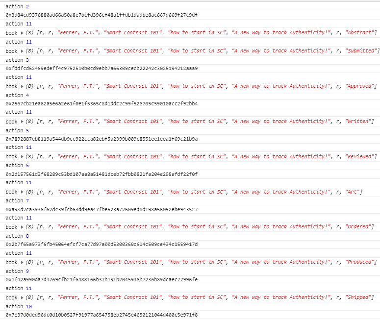

# blockchainnd-supplychain-part-b
Project for Part B of Term 2 Blockchain Udacity Nanodeegre Supply Chain project

For more information about Udacity BLockchain Developer Nanodegree check the [site](https://www.udacity.com/course/blockchain-developer-nanodegree--nd1309).
Some code from [here](https://github.com/udacity/nd1309-Project-6b-Example-Template) was imported to the contract.

**Describe a Supply Chain using Blockchain for the process of writing and selling a book. Since the abract and book approval to proced until the delivery to libraries.**

To install the dependencies run:
```
npm i
```

Then the http server
```
node index.js
```
open your brower in [http://localhost], can change the port by a variable with the same name.

Resources:
1. **UML Diagrams** (`diagram` folder)
1. **Smart Contract** (`contracts` folder)
1. **WebServer**

#UML Diagrams

*Contain the following Diagrams that describes the Smart Contract:*

1. Book Writing - Activity Diagram
1. Book Writing - Sequence Diagram
1. Book Writing - State Diagram
1. Book Writing - Classes Diagram

#Smart Contract
A Smart Contract was developed using [Solidity](https://solidity.readthedocs.io/en/v0.5.6/) and the [Ethereum Blockchain](https://www.ethereum.org/)

To develop this Smart Contract was used:
1. Truffle Ganache to create a local blockchain. 
   1. Some issues forced the use of JavaScript VM Env for payable method, see more [here](https://github.com/trufflesuite/ganache-cli/issues/497)
   1. to start Ganache with the same mnemonic (notice the high limit gas) (dev purpose only, DO NOT USE THIS IN PRODUCTION!):
      1. `ganache-cli -m "scale suit normal possible arm boost ridge blame orphan pilot rigid quit"  -l 999999999999`
1. Remix IDE to code solidity (.sol) files
   1. To compile and SYNC with local files the remixd npm module was used, see more details [here](https://remix.readthedocs.io/en/latest/tutorial_remixd_filesystem.html):
      1. `remixd -s <absolute-path-to-the-shared-folder> --remix-ide https://remix.ethereum.org`
   
For dev mode Ganache was used with one account per Role, when deployed in Rinkeby network only one account was used to reproduce the Roles.
### Smart Contract Rinkeby address:
>https://rinkeby.etherscan.io/address/0x6921b8078372867a9b5ed1c30f03158feb10cd70

### Default Account
>https://rinkeby.etherscan.io/address/0x5ccc6d873cc47149a9a303332b007ba65ff3301d

### Tx
>https://rinkeby.etherscan.io/tx/0xe08484fda805fcc133a48233a28478170a7d79710629220a51f5367d6b778061

## Smart Contract files
1. Folder `accesscontrol` contains the contracts with logic for the Roles:
1. Folder `base` contains the supply chain contract and the Transactions recorded:
    1. `SupplyChain.sol` supply chain with the method to interect with the Supply Chain
    1. `book1_scenario.json` file with the Transactions recorded in the Remix IDE Runtime, see how to use it [here](https://remix.readthedocs.io/en/latest/run_tab.html).
    Use this file to reproduce the scenario tested.
1. Folder `coew` contains the contract to ownership and transfer functions.
    
# Web Server
Webserver with Node.js with express to server as http server.
Node dependencies:
1. Express
1. web3
1. truffle
1. truffle-hdwallet-provider

### Tx Hashes
>Abstract - 0xfc3b9dacc5090827f6e1cf9aa68de27a43612dfa08e3eb2775683d2dbfe03dc6
>Submitted - 0x3d84cd9376880ad66a50a8e7bcfd396cf48a1ffdb1dadbe8ac667d669f27c9df
>Approved - 0xfddfcd62469edeff4c9752510b0cd9ebb7a66309cecb22242c3025194212aaa9
>Written - 0x2567cb21ea62a5e6a2e61f0e1f5365c8d1ddc2c99f526705c59010acc2f92bb4
>Reviewed - 0x7892887eb8119a544db9cc922cca82ebf5a2399b009c8551ee1eea1f69c21b9a
>Art - 0x2d157561d3f68289c53bd107aa8a51481dceb72fbb0821fa204e298afdf22f0f
>Ordered - 0xa98d2ca3936f62dc39fcb63dd9ea47fbe523a72609ed0d198a56052ebe943527
>Produced - 0x2b7f65a973f6fb45064efcf7ca77d97a00d5300360c614c509ce434c1559417d
>Shipped - 0x1f42a990da7d4769cfb21f6488166b37b191b2045946b7236b89dcaec77996fe
>Received - 0x7e37d0ded96dc0d10b0527f91977a654758eb2745e4650121044d460c5e971f8

An image connecting the hashes and the state during the functions
